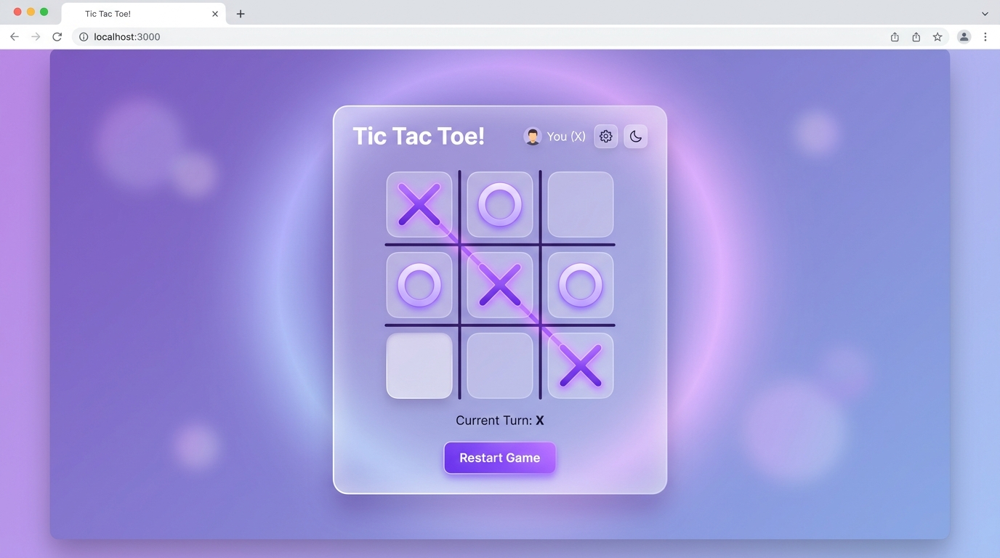

# 🎮 Tic Tac Toe

Un juego clásico de **Tres en Línea (Tic Tac Toe)** interactivo para la web, diseñado con una estética moderna en tonos lavanda/violeta con efecto *glassmorphism*, desarrollado enteramente con **JavaScript Vanilla (ES6+)**, **HTML5** y **CSS3**.

---

## 📸 Captura de Pantalla



---

## ✨ Características

- 👥 **Modo 2 Jugadores**: Ingreso personalizado de nombres para Jugador 1 (X) y Jugador 2 (O).
- 🎲 **Turno Inicial Aleatorio**: Selección aleatoria del jugador que inicia la partida.
- ⚡ **Detección Automática**: Comprobación instantánea de condiciones de victoria y empate.
- 🔄 **Reinicio Rápido**: Botón para reiniciar la partida conservando los jugadores activos.
- 🎨 **Diseño Moderno & Responsivo**:
  - Efectos *glassmorphism* (desenfoque y transparencias).
  - Gradientes dinámicos y sombras suaves.
  - Tipografía clara utilizando Google Fonts (*Inter*).

---

## 🛠️ Estructura del Código

El proyecto sigue buenas prácticas de organización y encapsulamiento mediante **Module Pattern (IIFE)** y **Factory Functions**:

- **`gameboard`** *(Module)*: Gestiona el estado y la lógica interna del tablero (9 posiciones).
- **`createPlayer`** *(Factory Function)*: Genera instancias de jugadores con sus nombres y fichas asignadas.
- **`gameController`** *(Module)*: Controla el flujo del juego, turnos, detección de ganadores y empates.
- **`displayController`** *(Module)*: Maneja la interacción con el DOM, renderizado de celdas y eventos de usuario.

---

## 📂 Estructura del Proyecto

```plaintext
Tic-Tac-Toe/
├── css/
│   └── style.css          # Estilos globales, reset y componentes visuales
├── js/
│   └── main.js            # Lógica del juego y manipulación del DOM
├── img/
│   ├── config.svg         # Iconos de la interfaz
│   ├── help1.svg
│   ├── next-right-arrow.svg
│   └── preview.jpg        # Captura de pantalla de la UI
├── index.html             # Estructura principal
└── README.md              # Documentación del proyecto
```

---

## 🚀 Cómo Ejecutar el Proyecto

1. **Clonar el repositorio**:
   ```bash
   git clone https://github.com/joacoContreras/Tic-Tac-Toe.git
   ```
2. **Abrir en el navegador**:
   - Simplemente abre el archivo `index.html` en tu navegador favorito, o utiliza una extensión de servidor local como **Live Server** en VS Code.

---

## 📄 Licencia

© 2026 Tic Tac Toe - Creado por [Joaquín Contreras](https://github.com/joacoContreras).
